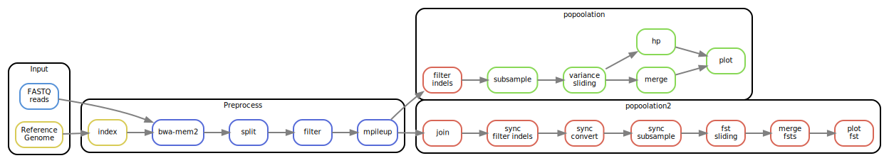

# smsk_popoolation: A Snakemake pipeline for population genomics

[](https://travis-ci.org/jlanga/smsk_popoolation)
[](https://zenodo.org/badge/latestdoi/76841262)

## 1. Description

This is a repo that contains installers and snakemake scripts to execute the pipelines described by Kofler et al. in popoolation 1 and 2:

- Mapping with `bwa-mem2`

- BAM wrangling and SNP calling with `samtools` and `picard`

- Population measures with `popoolation`. Computation of expected heterozygosity h_p with a python script.

- Pairwise comparisons between populations with `popoolation2`

## 2. First steps

Follow the contents of the `.travis.yml` file:

1. Install ([ana](https://www.continuum.io/downloads)|[mini](http://conda.pydata.org/miniconda.html))conda

2. Clone and install the software

    ```sh
    git clone https://github.com/jlanga/smsk_popoolation.git smsk_popoolation
    cd smsk_popoolation
    snakemake --use-conda --create-envs-only
    ```

3. Run the test dataset:

    ```sh
    snakemake --use-conda -c 8
    ```

4. Modify the following files:

    - `config/features.yaml`: the path to the genome reference, and the names of every chromosome to be processed.

    - `config/samples.tsv`: paths and library information of each of the samples.

    - `config/params.yml`: execution parameters of different tools.

5. Execute the pipeline:

    ```sh
    snakemake --use-conda -j
    ```

## Representation of the pipeline



## Bibliography

- [A Quick Guide to Organizing Computational Biology Projects](http://journals.plos.org/ploscompbiol/article?id=10.1371/journal.pcbi.1000424)

- [Snakemake—a scalable bioinformatics workflow engine](http://bioinformatics.oxfordjournals.org/content/28/19/2520)

- [popoolation](https://sourceforge.net/p/popoolation/wiki/Main/)

- [popoolation2](https://sourceforge.net/p/popoolation2/wiki/Main/)

- [samtools](http://www.htslib.org/)
